# Guía Completa de Pruebas - Sistema Bancario Virtual

## Índice

1. [Preparación del Entorno](#preparación-del-entorno)
2. [Pruebas del Backend](#pruebas-del-backend)
3. [Pruebas del Frontend](#pruebas-del-frontend)
4. [Pruebas de Integración](#pruebas-de-integración)
5. [Checklist de Verificación](#checklist-de-verificación)

---

## Preparación del Entorno

### 1. Verificar Instalación

**Backend:**
```bash
cd backend
npm install
npx prisma generate
npx prisma migrate dev --name init
```
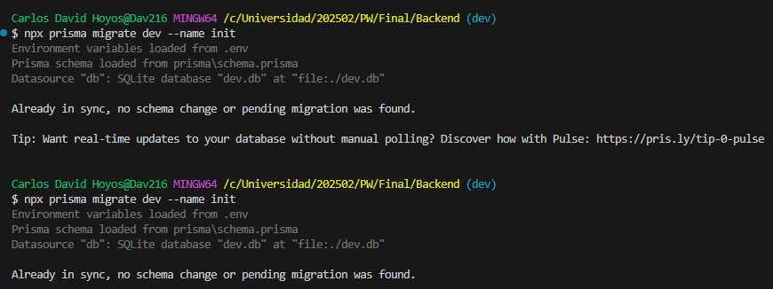

**Frontend:**
```bash
cd frontend
npm install
```
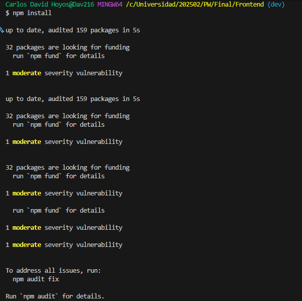

### 2. Verificar Variables de Entorno

**Backend (.env):**
```env
DATABASE_URL="file:./dev.db"
PORT=4000
```

**Frontend (.env):**
```env
VITE_API_URL=http://localhost:4000
```

### 3. Iniciar Servidores

**Terminal 1 - Backend:**
```bash
cd backend
npm run dev
```
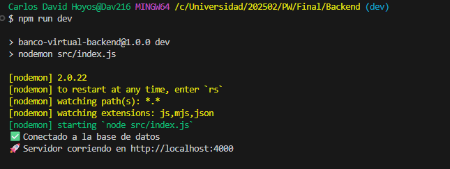

**Terminal 2 - Frontend:**
```bash
cd frontend
npm run dev
```


**Verificar que ambos servidores estén corriendo:**
- Backend: `http://localhost:4000`
- Frontend: `http://localhost:5173` (o el puerto que Vite asigne)

---

## Pruebas del Backend

### Prueba 1: Health Check

**Objetivo:** Verificar que el servidor responde

**Comando:**
```bash
curl http://localhost:4000/api/health
```

**Resultado Esperado:**
```json
{
  "status": "ok"
}
```

**✅ Éxito si:** Recibes status 200 y el JSON con "ok"

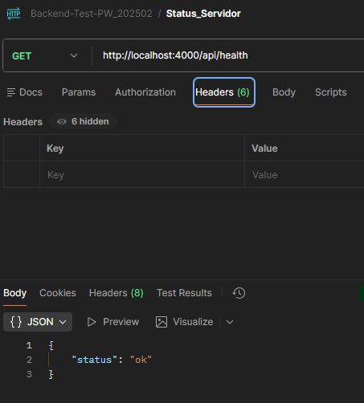
---

### Prueba 2: Registro de Usuario

**Objetivo:** Crear un nuevo usuario

**Comando:**
```bash
curl -X POST http://localhost:4000/api/auth/register \
  -H "Content-Type: application/json" \
  -d '{
    "nombre": "Juan Pérez",
    "email": "juan@test.com",
    "password": "password123"
  }'
```

**Resultado Esperado:**
```json
{
  "message": "Usuario registrado exitosamente",
  "user": {
    "id": 1,
    "nombre": "Juan Pérez",
    "email": "juan@test.com"
  }
}
```

**✅ Éxito si:** 
- Status 201
- Recibes el mensaje de éxito
- El usuario tiene un ID asignado
- NO incluye la password

**Pruebas Adicionales:**
- Intentar registrar el mismo email dos veces → Debe dar error 400
- Registrar sin campos requeridos → Debe dar error 400
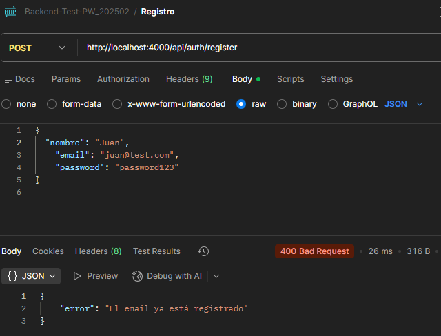
---

### Prueba 3: Login

**Objetivo:** Iniciar sesión con credenciales válidas

**Comando:**
```bash
curl -X POST http://localhost:4000/api/auth/login \
  -H "Content-Type: application/json" \
  -d '{
    "email": "juan@test.com",
    "password": "password123"
  }'
```

**Resultado Esperado:**
```json
{
  "message": "Login exitoso",
  "user": {
    "id": 1,
    "nombre": "Juan Pérez",
    "email": "juan@test.com",
    "saldo": 0
  }
}
```

**✅ Éxito si:**
- Status 200
- Recibes los datos del usuario
- Incluye el saldo (debe ser 0 para usuario nuevo)
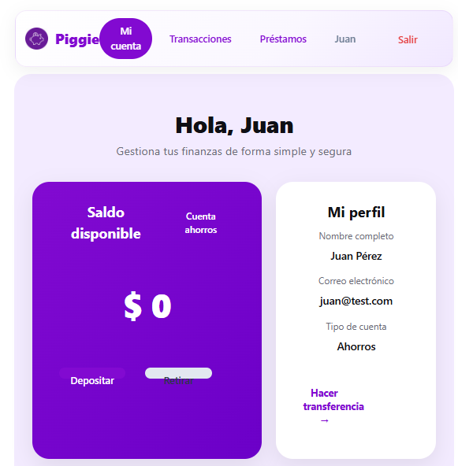

**Pruebas Adicionales:**
- Login con password incorrecta → Error 401
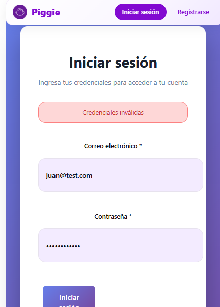

- Login con email inexistente → Error 401
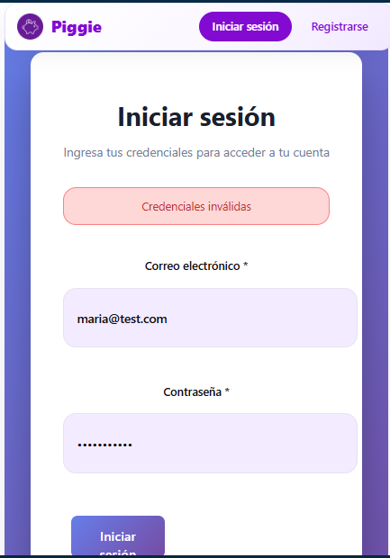


---

### Prueba 4: Obtener Usuarios

**Objetivo:** Listar todos los usuarios

**Comando:**
```bash
curl http://localhost:4000/api/users
```

**Resultado Esperado:**
```json
{
  "users": [
    {
      "id": 1,
      "nombre": "Juan Pérez",
      "email": "juan@test.com",
      "saldo": 0,
      "createdAt": "2024-..."
    }
  ]
}
```

**✅ Éxito si:**
- Status 200
- Array de usuarios
- NO incluye passwords

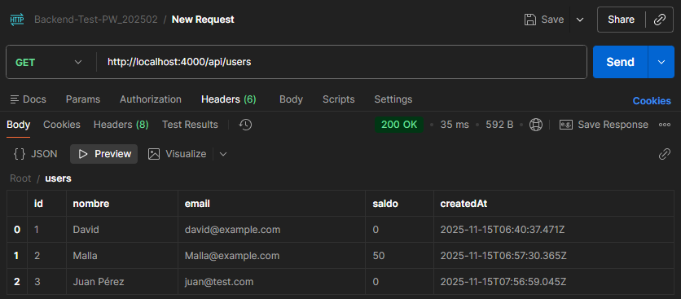

---

### Prueba 5: Obtener Usuario por ID

**Comando:**
```bash
curl http://localhost:4000/api/users/3
```

**Resultado Esperado:**
```json
{
  "user": {
    "id": 3,
    "nombre": "Juan Pérez",
    "email": "juan@test.com",
    "saldo": 0,
    "createdAt": "2024-..."
  }
}
```


**✅ Éxito si:** Status 200 y datos del usuario
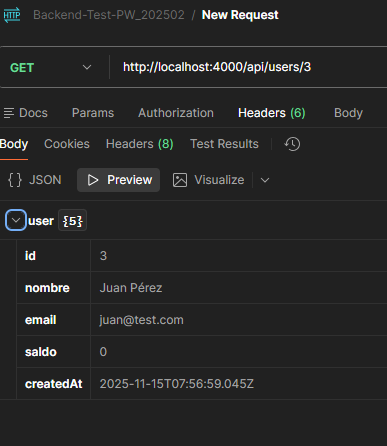

**Prueba Adicional:**
- ID inexistente (ej: /users/999) → Error 404
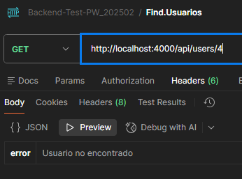

---

### Prueba 6: Crear Depósito

**Objetivo:** Depositar dinero a un usuario

**Comando:**
```bash
curl -X POST http://localhost:4000/api/transacciones/deposito \
  -H "Content-Type: application/json" \
  -d '{
    "usuario_id": 3,
    "monto": 1000,
    "descripcion": "Depósito inicial"
  }'
```

**Resultado Esperado:**
```json
{
  "message": "Depósito realizado exitosamente",
  "monto": 1000
}
```

**Verificar Saldo:**
```bash
curl http://localhost:4000/api/users/3
```
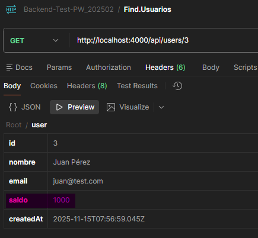

**✅ Éxito si:**
- Status 201
- El saldo del usuario aumentó a 1000
- Se creó una transacción tipo 'deposito'
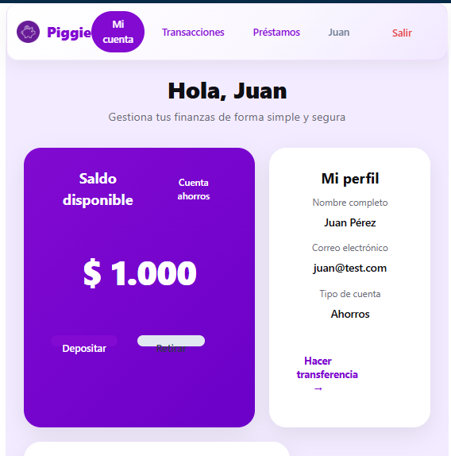
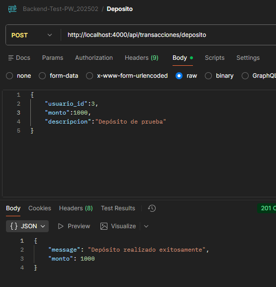
---

### Prueba 7: Crear Retiro

**Objetivo:** Retirar dinero (con saldo suficiente)

**Comando:**
```bash
curl -X POST http://localhost:4000/api/transacciones/retiro \
  -H "Content-Type: application/json" \
  -d '{
    "usuario_id": 1,
    "monto": 300,
    "descripcion": "Retiro de cajero"
  }'
```

**Resultado Esperado:**
```json
{
  "message": "Retiro realizado exitosamente",
  "monto": 300
}
```
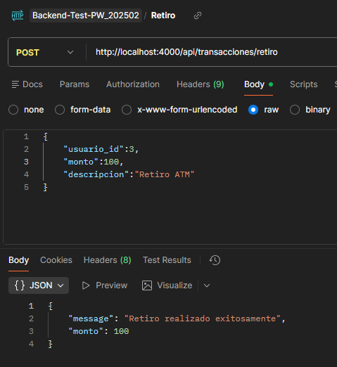

**Verificar Saldo:**
- El saldo debe ser 900 (1000 - 100)


**✅ Éxito si:**
- Status 201
- El saldo se redujo correctamente
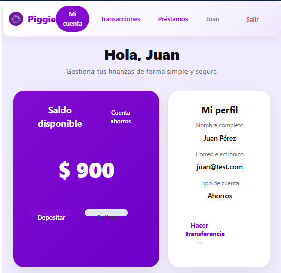

**Prueba Adicional:**
- Retirar más de lo disponible → Error 400 "Saldo insuficiente"
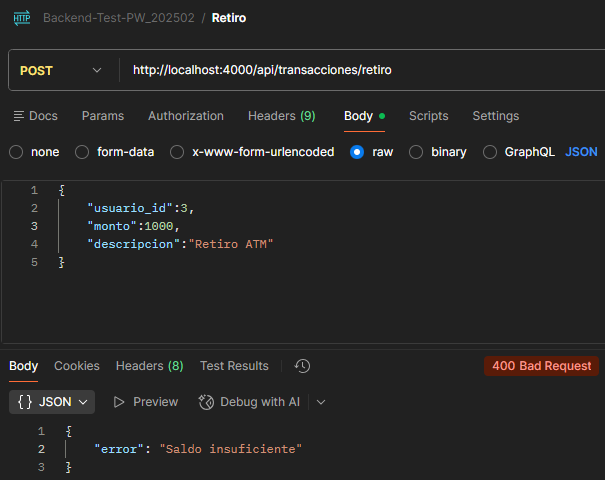

---

### Prueba 8: Crear Segundo Usuario

**Comando:**
```bash
curl -X POST http://localhost:4000/api/auth/register \
  -H "Content-Type: application/json" \
  -d '{
    "nombre": "María García",
    "email": "maria@test.com",
    "password": "password456"
  }'
```
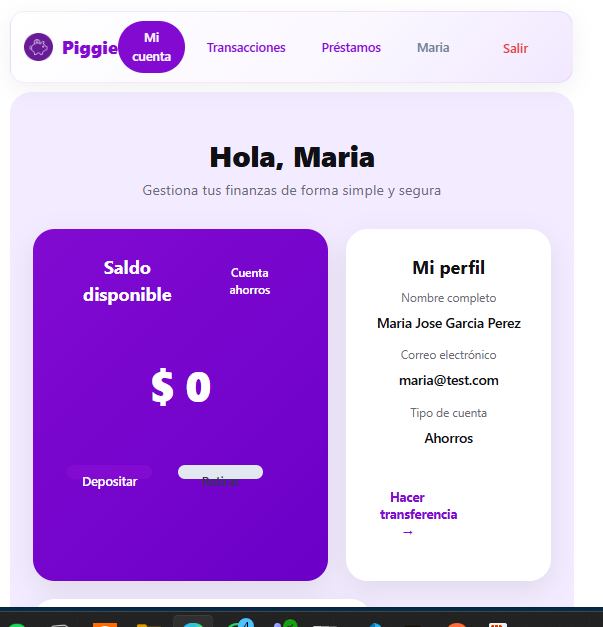

**Anotar el ID del segundo usuario** (probablemente 2)

---

### Prueba 9: Transferencia

**Objetivo:** Transferir dinero entre usuarios

**Comando:**
```bash
curl -X POST http://localhost:4000/api/transacciones/transferencia \
  -H "Content-Type: application/json" \
  -d '{
    "usuario_id": 3,
    "usuario_destino_id": 4,
    "monto": 200,
    "descripcion": "Pago de servicios"
  }'
```

**Resultado Esperado:**
```json
{
  "message": "Transferencia realizada exitosamente",
  "monto": 200
}
```
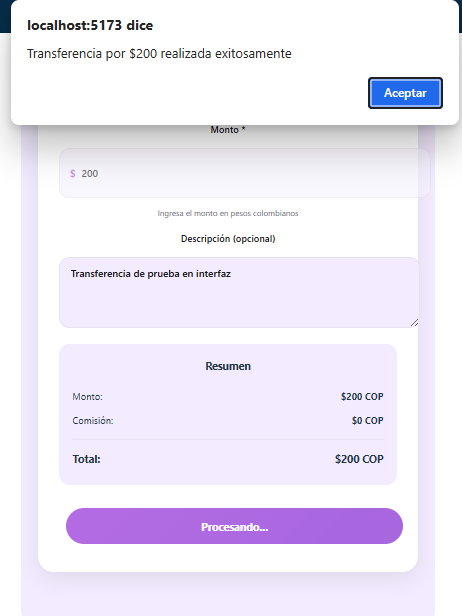

**Verificar Saldos:**
```bash
curl http://localhost:4000/api/users/3
curl http://localhost:4000/api/users/4
```

**✅ Éxito si:**
- Status 201
- Usuario 3 tiene saldo 500 (700 - 200)
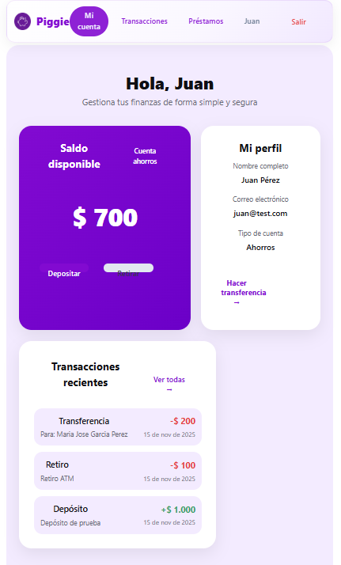
- Usuario 4 tiene saldo 200 (0 + 200)
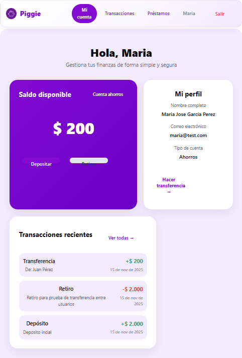

**Pruebas Adicionales:**
- Transferir a uno mismo → Error 400
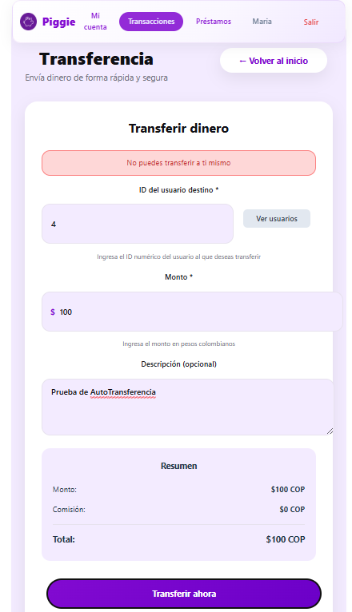

- Transferir más de lo disponible → Error 400
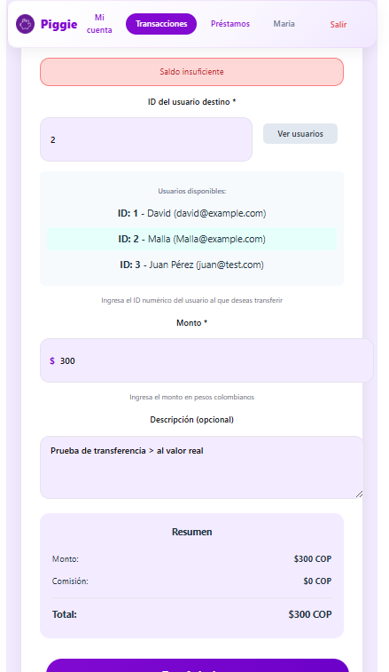


---

### Prueba 10: Obtener Transacciones

**Comando:**
```bash
curl "http://localhost:4000/api/transacciones?usuario_id=1"
```

**Resultado Esperado:**
```json
{
  "transacciones": [
    {
      "id": 3,
      "usuario_id": 1,
      "usuario_destino_id": 2,
      "tipo": "transferencia",
      "monto": 200,
      ...
    },
    {
      "id": 2,
      "usuario_id": 1,
      "tipo": "retiro",
      "monto": 300,
      ...
    },
    {
      "id": 1,
      "usuario_id": 1,
      "tipo": "deposito",
      "monto": 1000,
      ...
    }
  ]
}
```

**✅ Éxito si:**
- Status 200
- Muestra todas las transacciones del usuario
- Ordenadas de más reciente a más antigua
- Incluye nombres de usuarios origen/destino
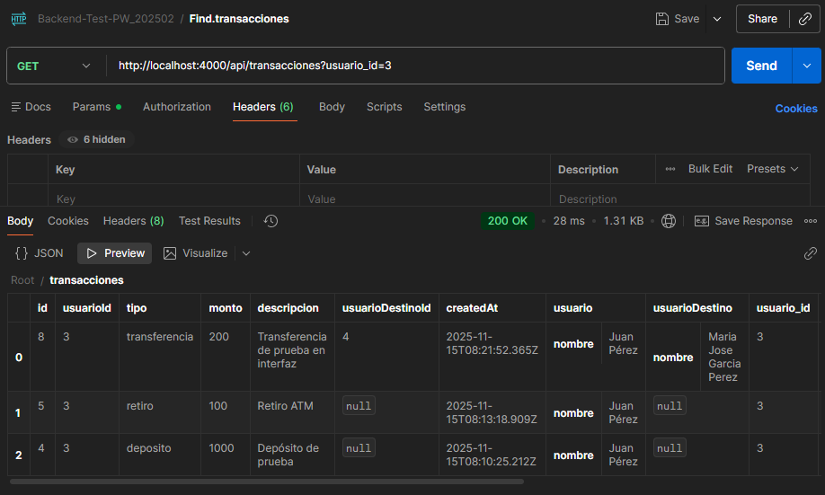

---

### Prueba 11: Crear Préstamo

**Comando:**
```bash
curl -X POST http://localhost:4000/api/prestamos \
  -H "Content-Type: application/json" \
  -d '{
    "usuario_id": 1,
    "monto": 5000,
    "tasa_interes": 5.00,
    "plazo_meses": 12
  }'
```

**Resultado Esperado:**
```json
{
  "message": "Préstamo solicitado exitosamente",
  "prestamo": {
    "id": 1,
    "monto": 5000,
    "tasa_interes": 5.00,
    "plazo_meses": 12,
    "estado": "pendiente"
  }
}
```

**✅ Éxito si:**
- Status 201
- Estado es "pendiente"
- Tiene ID asignado


---

### Prueba 12: Obtener Préstamos

**Comando:**
```bash
curl "http://localhost:4000/api/prestamos?usuario_id=1"
```

**Resultado Esperado:**
```json
{
  "prestamos": [
    {
      "id": 1,
      "usuario_id": 1,
      "monto": 5000,
      "estado": "pendiente",
      ...
    }
  ]
}
```

**✅ Éxito si:** Status 200 y lista de préstamos
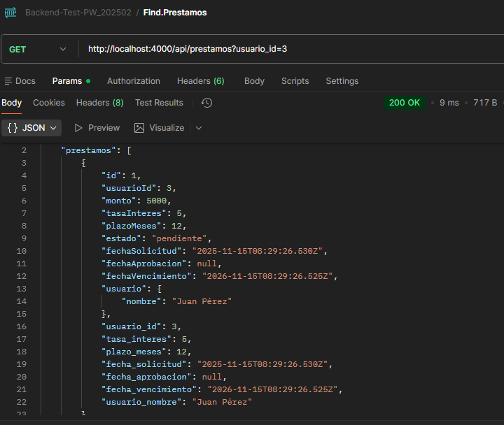

---

### Prueba 13: Aprobar Préstamo

**Comando:**
```bash
curl -X PUT http://localhost:4000/api/prestamos/1/aprobar
```

**Resultado Esperado:**
```json
{
  "message": "Préstamo aprobado exitosamente"
}
```

**Verificar:**
1. Estado del préstamo cambió a "aprobado"
2. Saldo del usuario aumentó en 5000
3. Se creó una transacción tipo "deposito"

**Comandos de Verificación:**
```bash
curl "http://localhost:4000/api/prestamos?usuario_id=1"
curl http://localhost:4000/api/users/1
curl "http://localhost:4000/api/transacciones?usuario_id=1"
```

**✅ Éxito si:**
- Préstamo está "aprobado"
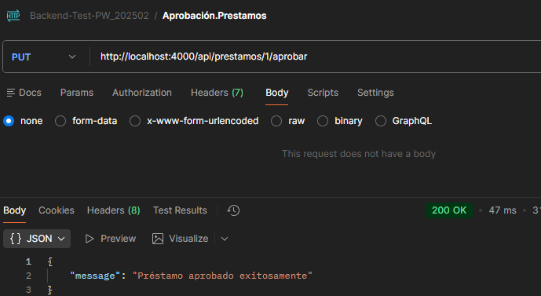

- Saldo aumentó correctamente
- Existe transacción de depósito asociada
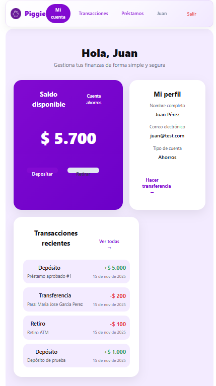

---

### Prueba 14: Actualizar Usuario

**Comando:**
```bash
curl -X PUT http://localhost:4000/api/users/1 \
  -H "Content-Type: application/json" \
  -d '{
    "nombre": "Juan Carlos Pérez"
  }'
```

**Verificar:**
```bash
curl http://localhost:4000/api/users/1
```

**✅ Éxito si:** El nombre se actualizó
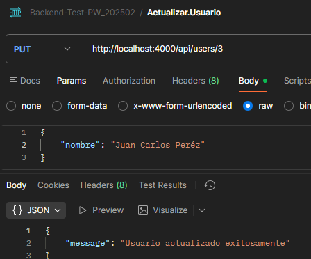
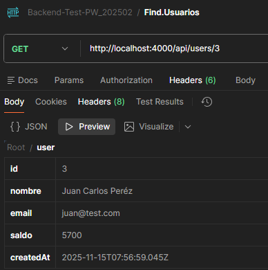
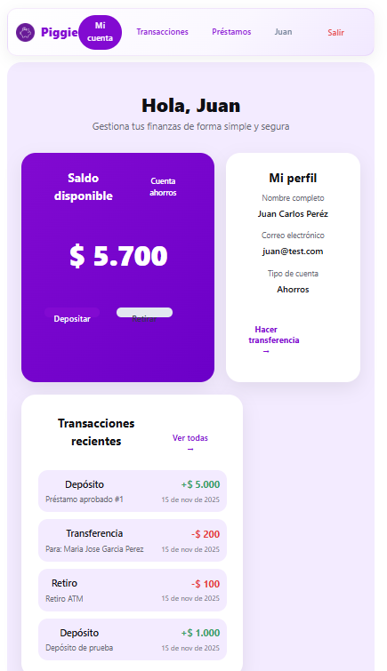

---

### Prueba 15: Eliminar Usuario

**⚠️ ADVERTENCIA:** Esto eliminará el usuario y todas sus transacciones/préstamos

**Comando:**
```bash
curl -X DELETE http://localhost:4000/api/users/4
```

**Verificar:**
```bash
curl http://localhost:4000/api/users/4
```
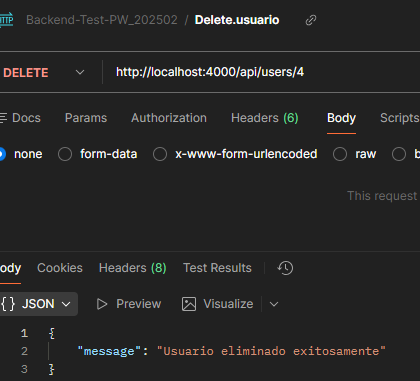


**✅ Éxito si:** Error 404 (usuario no encontrado)
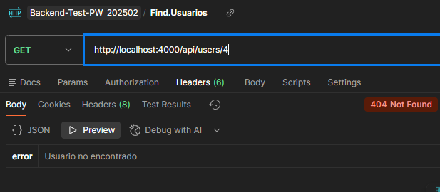

---

## Pruebas del Frontend

### Prueba 1: Acceso a la Aplicación

1. Abre `http://localhost:5173` (o el puerto que Vite muestre)
2. Debe cargar la página de inicio

**✅ Éxito si:** La página carga sin errores en la consola

---

### Prueba 2: Navegación

1. Verifica que el Header se muestra
2. Haz clic en "Registrarse"
3. Haz clic en "Iniciar sesión"
4. Haz clic en el logo para volver al inicio

**✅ Éxito si:** La navegación funciona correctamente

---

### Prueba 3: Registro de Usuario

1. Ve a `/registro`
2. Completa el formulario:
   - Email: `test@frontend.com`
   - Confirma email
   - Primer nombre: `Test`
   - Primer apellido: `Usuario`
   - Password: `test123`
   - Confirma password
3. Haz clic en "Crear cuenta"

**✅ Éxito si:**
- Redirige a `/dashboard`
- Muestra el nombre del usuario
- El saldo es $0

**Pruebas Adicionales:**
- Emails que no coinciden → Muestra error
- Passwords que no coinciden → Muestra error
- Password menor a 6 caracteres → Muestra error
- Campos vacíos → Muestra error

---

### Prueba 4: Login

1. Ve a `/login`
2. Ingresa:
   - Email: `test@frontend.com`
   - Password: `test123`
3. Haz clic en "Iniciar sesión"

**✅ Éxito si:**
- Redirige a `/dashboard`
- Muestra los datos del usuario

**Pruebas Adicionales:**
- Credenciales incorrectas → Muestra error
- Campos vacíos → Muestra error

---

### Prueba 5: Dashboard

1. Verifica que se muestre:
   - Saldo disponible
   - Información del perfil
   - Transacciones recientes (si hay)

**✅ Éxito si:** Todos los elementos se muestran correctamente

---

### Prueba 6: Depósito

1. En el Dashboard, haz clic en "Depositar"
2. Ingresa monto: `5000`
3. Descripción: `Depósito de prueba`
4. Haz clic en "Depositar"

**✅ Éxito si:**
- Muestra alerta de éxito
- El saldo se actualiza
- Aparece la transacción en la lista

---

### Prueba 7: Retiro

1. En el Dashboard, haz clic en "Retirar"
2. Ingresa monto: `1000`
3. Descripción: `Retiro de prueba`
4. Haz clic en "Retirar"

**✅ Éxito si:**
- Muestra alerta de éxito
- El saldo se reduce
- Aparece la transacción en la lista

**Prueba Adicional:**
- Intentar retirar más del saldo disponible → Muestra error

---

### Prueba 8: Transferencia

1. Ve a `/transacciones`
2. Haz clic en "Ver usuarios"
3. Selecciona un usuario de la lista (o ingresa ID manualmente)
4. Ingresa monto: `500`
5. Descripción: `Transferencia de prueba`
6. Haz clic en "Transferir ahora"

**✅ Éxito si:**
- Muestra alerta de éxito
- Redirige a dashboard
- El saldo se actualiza

**Pruebas Adicionales:**
- Transferir a uno mismo → Muestra error
- Transferir más del saldo → Muestra error

---

### Prueba 9: Solicitud de Préstamo

1. Ve a `/prestamos`
2. Completa el formulario:
   - Monto: `10000`
   - Plazo: `12 meses`
   - Propósito: `Uso personal`
   - Ingresos: `2000000`
   - Ocupación: `Empleado`
   - Acepta términos
3. Haz clic en "Solicitar préstamo"

**✅ Éxito si:**
- Muestra alerta de éxito
- Redirige a dashboard

**Pruebas Adicionales:**
- Sin aceptar términos → Muestra error
- Campos vacíos → Muestra error

---

### Prueba 10: Logout

1. Haz clic en "Salir" en el Header
2. Verifica que se limpia la sesión

**✅ Éxito si:**
- Redirige a inicio
- El Header muestra "Iniciar sesión" y "Registrarse"
- localStorage está vacío

---

## Pruebas de Integración

### Flujo Completo 1: Registro → Depósito → Transferencia

1. Registra un nuevo usuario
2. Deposita $5000
3. Crea un segundo usuario
4. Transfiere $2000 al segundo usuario
5. Verifica saldos en ambos usuarios

**✅ Éxito si:** Todos los saldos son correctos

---

### Flujo Completo 2: Préstamo → Aprobación

1. Solicita un préstamo de $10000
2. Aprueba el préstamo desde el backend (curl)
3. Verifica que el saldo aumentó
4. Verifica que existe transacción de depósito

**✅ Éxito si:** Todo se actualiza correctamente

---

## Checklist de Verificación

### Backend

- [x] Servidor inicia sin errores
- [x] Health check responde
- [x] Registro de usuario funciona
- [x] Login funciona
- [x] Obtener usuarios funciona
- [x] Depósito funciona y actualiza saldo
- [x] Retiro funciona y valida saldo
- [x] Transferencia funciona entre usuarios
- [x] Obtener transacciones funciona
- [x] Crear préstamo funciona
- [ ] Aprobar préstamo actualiza saldo
- [ ] Actualizar usuario funciona
- [ ] Eliminar usuario funciona
- [ ] Validaciones de errores funcionan
- [ ] Transacciones de BD son atómicas

### Frontend

- [ ] Aplicación carga sin errores
- [ ] Navegación funciona
- [ ] Registro funciona
- [ ] Login funciona
- [ ] Dashboard muestra datos correctos
- [ ] Depósito funciona
- [ ] Retiro funciona
- [ ] Transferencia funciona
- [ ] Solicitud de préstamo funciona
- [ ] Logout funciona
- [ ] Validaciones de formularios funcionan
- [ ] Manejo de errores funciona
- [ ] localStorage funciona correctamente

### Integración

- [ ] Frontend se conecta al backend
- [ ] Datos se sincronizan correctamente
- [ ] Flujos completos funcionan
- [ ] No hay errores en consola del navegador
- [ ] No hay errores en consola del servidor

---

## Scripts de Prueba Automatizados

Para facilitar las pruebas, puedes usar los scripts que se proporcionan en el siguiente archivo.

---

## Solución de Problemas

### Error: "Cannot find module"
**Solución:** Ejecuta `npm install` en el directorio correspondiente

### Error: "Database not found"
**Solución:** Ejecuta `npx prisma migrate dev --name init`

### Error: "Port already in use"
**Solución:** Cambia el puerto en `.env` o cierra el proceso que usa el puerto

### Error: CORS
**Solución:** Verifica que `cors()` esté configurado en `app.js`

### Frontend no se conecta al backend
**Solución:** Verifica `VITE_API_URL` en `.env` del frontend

---

## Resultados Esperados

Al completar todas las pruebas, deberías tener:

1. **Backend funcionando:**
   - Todos los endpoints responden correctamente
   - Las transacciones son atómicas
   - Los datos se persisten correctamente

2. **Frontend funcionando:**
   - Todas las páginas cargan
   - Los formularios funcionan
   - La navegación es fluida

3. **Integración funcionando:**
   - Frontend y backend se comunican
   - Los datos se sincronizan
   - No hay errores de conexión

¡Listo para usar! 🎉

